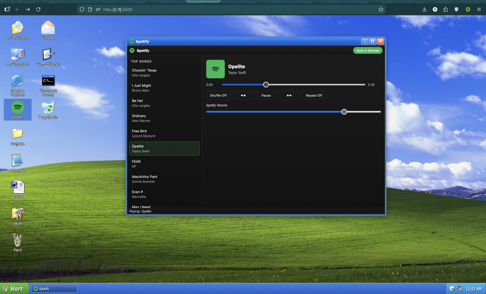

A front-end portfolio built as a Windows XP-style desktop experience.

This project recreates the feel of XP in the browser: boot/login flow, desktop icons, draggable windows, taskbar/start menu behavior, classic sounds, and retro-styled apps. It is a static site (no backend).

## What This Repo Includes

- XP-like session flow: boot screen, login, desktop, shutdown/restart.
- Desktop shell: draggable icons, selection box, snap-to-grid behavior, keyboard shortcuts.
- Window system: draggable/focus/minimize/maximize/close windows with XP-style chrome.
- Taskbar and Start Menu with app launch support.
- Sound events (startup, click, errors, window actions).
- Built-in apps:
  - Notepad (editable, save/new/select-all/time-date/word-wrap)
  - Paint (drawing canvas + save)
  - My Computer (Explorer-style layout)
  - Internet Explorer (embedded web view)
  - Spotify (embedded player)
  - Control Panel (theme/wallpaper/sound toggles)
  - Command Prompt (mock shell commands)
- `Resume` shortcut redirects directly to: `https://x.com/vedangstwt`

## Tech Stack

- HTML
- CSS
- Vanilla JavaScript (modular files in `js/`)

No framework, no build step, no server-side code.

## How It Works (High Level)

- `index.html`: Main shell markup (boot, login, desktop, taskbar, start menu).
- `js/sessionManager.js`: Session lifecycle (boot/login/shutdown).
- `js/windowManager.js`: Window lifecycle, icon drag/snap, app launching.
- `js/appsRegistry.js`: App definitions and app content templates.
- `js/taskbarController.js`: Start menu and taskbar behavior.
- `js/contextMenu.js`, `js/clock.js`, `js/soundManager.js`, `js/personalization.js`: Supporting desktop subsystems.
- `css/*.css`: UI styling split by area (desktop, windows, taskbar, start menu).

## Run Locally

Because this app uses audio/assets/iframes, run it through a local server (recommended), not `file://`.

### Option 1 (Python)

```bash
cd /Users/vedang/Desktop/personal-website
python3 -m http.server 5500
```

Open: `http://localhost:5500`

### Option 2 (Node)

```bash
cd /Users/vedang/Desktop/personal-website
npx serve .
```

Open the URL shown in terminal.

## Customization

- Profile text, projects, contacts, app metadata: `js/appsRegistry.js`
- Wallpapers/themes: `js/personalization.js` + assets
- Sounds: `js/soundManager.js` + `assets/sounds/`
- Start menu and desktop app wiring: `index.html` + `js/appsRegistry.js`

## Notes

- This is a UI/UX portfolio project and does not emulate a full operating system.
- Some embedded external content (for example Spotify/web pages) depends on third-party availability and browser policies.
